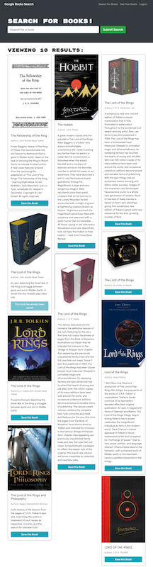

# Book Worm

## User Story
As an avid reader, I want to search for new books to read so that I can keep a list of books to purchase.

## Application Details
- A book search engine that connects to Google Books API, where the user is able to save their favorite books to their own profile page.
- This is done with a REACT front-end, and an Express & Node.js backend with GraphQL as the server.
 

## Challenges Faced
- I still have not been able to figure out how to push the correct data to my savedBooks array. It pushes correctly, but then it recieves the data as null for some reason.
- Have recieved strange errors from the node packages, and haven't been able to de-bug them.

 

## *Links to GitHub Repository & a deployed App:*

- **[Link to the GitHub Repository](https://github.com/Doctor-Worm/book-worm)**

- **[Link to Deployed App](https://glacial-plateau-63448.herokuapp.com/)**

